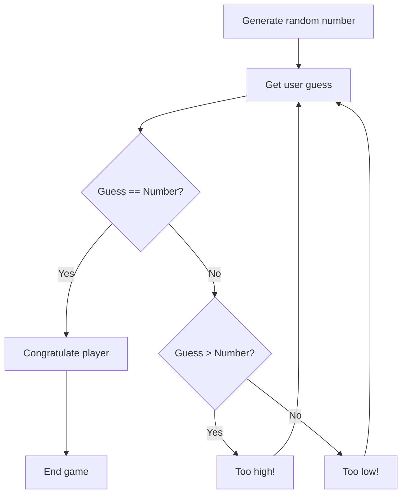

## Chapter 3: Building Your First Application: A Simple Number Guessing Game 🎉

**Key Learning Objectives:**

*   Integrate all learned concepts to build a functional application.
*   Design the structure and logic of a simple game.
*   Implement user interaction and game rules.
*   Test and debug the application.
*   Understand the iterative development process.

Let's put your Python skills to the test! In this chapter, we'll build a classic: the Number Guessing Game. This project will solidify your understanding of variables, loops, conditional statements, and user input. Get ready to create something fun and interactive!

### Application Overview 🕹️

The Number Guessing Game is simple: The computer picks a random number, and you, the player, try to guess it. The game provides feedback ("Too high!", "Too low!") until you guess correctly. Sounds easy? Let's code it!

### Game Logic Design 🧠

Before we dive into the code, let's break down the game into manageable steps:

1.  **Generate a random number:** The computer needs to choose a secret number within a specific range (e.g., 1 to 100).
2.  **Get user input:** Ask the player to guess the number.
3.  **Compare the guess:** Check if the guess is too high, too low, or correct.
4.  **Provide feedback:** Tell the player if their guess was too high or too low.
5.  **Repeat steps 2-4:** Keep asking for guesses until the player guesses correctly.
6.  **Congratulate the player:** Once the player guesses right, congratulate them!

Here's a flowchart to visualize the process:



### Implementation 💻

Now, let's translate our design into Python code:

```python
import random

def number_guessing_game():
    secret_number = random.randint(1, 100)  # Generate random number between 1 and 100
    guess = 0
    attempts = 0

    print("Welcome to the Number Guessing Game!")
    print("I'm thinking of a number between 1 and 100.")

    while guess != secret_number:
        try:
            guess = int(input("Take a guess: "))
            attempts += 1
        except ValueError:
            print("Invalid input. Please enter a number.")
            continue

        if guess < secret_number:
            print("Too low!")
        elif guess > secret_number:
            print("Too high!")
        else:
            print(f"Congratulations! You guessed the number in {attempts} attempts.")

number_guessing_game()
```

**Explanation:**

*   `import random`: Imports the `random` module to generate random numbers.
*   `random.randint(1, 100)`: Generates a random integer between 1 and 100 (inclusive).
*   `input()`: Gets the player's guess as a string.
*   `int()`: Converts the string input to an integer.  We use a `try-except` block to handle potential `ValueError` if the user enters non-numeric input.
*   `if/elif/else`:  Compares the guess to the secret number and provides feedback.
*   `while`:  Keeps the game running until the guess is correct.

### Testing and Debugging 🐞

After writing the code, it's crucial to test it thoroughly. Play the game yourself and try different inputs to see if it behaves as expected. What happens if you enter a letter instead of a number? What if you guess the same number multiple times?

**Debugging Tip:** Use `print()` statements to display the value of variables at different points in the code. For example, you could print the `secret_number` at the beginning of the game (for testing purposes only!).

### Enhancements (Optional) ✨

Want to make the game even better? Here are some ideas:

*   **Limit the number of guesses:** Give the player only a certain number of attempts.
*   **Provide hints:** Offer more specific hints, like "You're getting warmer!" if the guess is close.
*   **Keep track of scores:** Store the number of attempts for each game and display the best score.
*   **Difficulty levels:** Allow the player to choose the range of numbers (e.g., 1-10, 1-100, 1-1000).

### Deployment & Sharing 📤

While we won't delve into complex deployment methods, you can easily share your game by sending the Python script to a friend! They'll need to have Python installed to run it.  For more advanced sharing, you could explore creating a simple graphical interface using libraries like Tkinter or Pygame (topics for another adventure!).

This simple game encapsulates the core principles you've learned. Each line of code is a testament to your new abilities.

**Your 24-Hour Task:**

1.  Type out the Number Guessing Game code in your editor.
2.  Play the game and make sure it works.
3.  Implement at least ONE enhancement from the list above.

Congratulations on completing your first Python application! You've taken a significant step towards becoming a Python programmer. Keep practicing, keep experimenting, and keep building! The possibilities are endless! 🚀