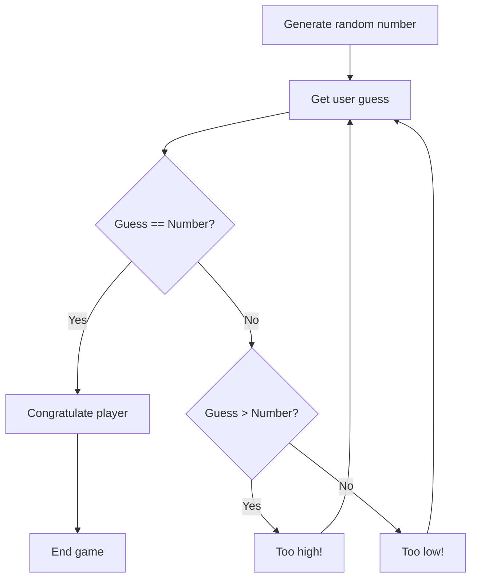

**Python Jumpstart: Code Your First App in a Weekend**

**Course Difficulty:** Beginner
**Number of Chapters:** 3

**Course Outline:**

**Chapter 1: Python Fundamentals & Setting Up Your Development Environment**

*   **Key Learning Objectives:**
    *   Understand what Python is and its applications.
    *   Install Python and a suitable code editor (e.g., VS Code, Thonny).
    *   Learn basic Python syntax (variables, data types, operators).
    *   Write and execute simple Python scripts.
    *   Understand input and output operations.
    *   Learn about comments and code readability.

*   **Chapter Content:**
    *   **Introduction to Python:** History, features, and use cases of Python. Why Python is a good choice for beginners.
    *   **Setting Up Your Environment:** Step-by-step guide to installing Python on different operating systems (Windows, macOS, Linux). Introduction to Integrated Development Environments (IDEs) and choosing a suitable editor (VS Code, Thonny, or similar). Installing necessary extensions for Python development.
    *   **Basic Python Syntax:** Variables, data types (integers, floats, strings, booleans), operators (arithmetic, comparison, logical), and basic input/output using `print()` and `input()`.
    *   **Your First Python Script:** Writing and running a simple "Hello, World!" program. Understanding the execution flow of a Python script.
    *   **Comments and Code Style:** Importance of code comments for documentation and readability. Introduction to basic code style guidelines (e.g., PEP 8).

**Chapter 2: Core Programming Concepts & Building Interactive Features**

*   **Key Learning Objectives:**
    *   Understand control flow statements (if/else, loops).
    *   Work with data structures (lists, dictionaries).
    *   Define and use functions.
    *   Handle user input and perform basic data validation.
    *   Learn about string manipulation.
    *   Understand the concept of modules and importing them.

*   **Chapter Content:**
    *   **Control Flow:** `if`, `elif`, `else` statements for conditional execution. `for` and `while` loops for iteration. Examples and exercises to practice control flow.
    *   **Data Structures:** Introduction to lists (creating, accessing, modifying), and dictionaries (creating, accessing, modifying). Examples of using lists and dictionaries to store and organize data.
    *   **Functions:** Defining and calling functions. Function arguments and return values. Scope of variables (local vs. global). Writing reusable code using functions.
    *   **User Input and Data Validation:** Getting user input using `input()`. Converting input to different data types. Basic data validation techniques (e.g., checking if a number is within a certain range).
    *   **String Manipulation:** String concatenation, slicing, and common string methods (e.g., `upper()`, `lower()`, `split()`, `join()`).
    *   **Modules:** Introduction to modules and the `import` statement. Using built-in modules (e.g., `random`, `math`).

**Chapter 3: Building Your First Application: A Simple Number Guessing Game**

*   **Key Learning Objectives:**
    *   Integrate all learned concepts to build a functional application.
    *   Design the structure and logic of a simple game.
    *   Implement user interaction and game rules.
    *   Test and debug the application.
    *   Understand the iterative development process.

*   **Chapter Content:**
    *   **Application Overview:** Introduction to the Number Guessing Game. Explanation of the game rules and desired functionality.
    *   **Game Logic Design:** Breaking down the game into smaller tasks (e.g., generating a random number, getting user input, comparing the guess, providing feedback).
    *   **Implementation:** Writing the Python code for the Number Guessing Game, integrating functions, control flow, data structures, and user input.
    *   **Testing and Debugging:** Testing the game thoroughly to identify and fix bugs. Using debugging techniques (e.g., print statements, debugger tools).
    *   **Enhancements (Optional):** Adding features to the game (e.g., limiting the number of guesses, providing hints, keeping track of scores).
    *   **Deployment & Sharing:** Briefly discuss ways to share the game with others.

**Suggested Learning Progression:**

1.  **Chapter 1:** Complete all sections sequentially. Ensure a solid understanding of basic syntax and environment setup before moving on.
2.  **Chapter 2:** Follow the order of sections. Practice each concept with the provided exercises before proceeding to the next. Pay close attention to control flow and data structures.
3.  **Chapter 3:**  Start by understanding the game logic design. Implement the code step-by-step, testing each part as you go. Don't be afraid to experiment and modify the code to add your own features.


# Chapter 1: Python Fundamentals & Setting Up Your Development Environment 🐍

## Why Python? 🤔

Imagine having a superpower that lets you automate tasks, build websites, analyze data, and even create games! That's Python. It's a versatile, easy-to-learn programming language loved by beginners and experts alike. Big companies like Google, Netflix, and Instagram use Python. Why? Because it's powerful, readable, and has a HUGE community offering support.

## What is Python? 💡

Python is a high-level, interpreted programming language. "High-level" means it's closer to human language than machine code, making it easier to understand. "Interpreted" means your code is executed line by line, making debugging simpler. Think of it as having a translator who reads your instructions and tells the computer what to do.

## How to Set Up Your Environment 🛠️

Let's get Python installed and ready to go!

1.  **Install Python:**
    *   **Windows:** Download the installer from [python.org](https://www.python.org/downloads/windows/). Make sure to check "Add Python to PATH" during installation. This lets you run Python from anywhere in your command prompt.
    *   **macOS:** Python often comes pre-installed. You can check by opening Terminal and typing `python3 --version`. If it's not there or an older version, download the installer from [python.org](https://www.python.org/downloads/macos/).
    *   **Linux:** Python is usually pre-installed. Check the version with `python3 --version`. If needed, install using your distribution's package manager (e.g., `sudo apt-get install python3` on Ubuntu/Debian).

2.  **Choose a Code Editor (IDE):**
    *   **VS Code:** A popular, powerful editor with many extensions. Install the Python extension for syntax highlighting, debugging, and more. [VS Code Download](https://code.visualstudio.com/download)
    *   **Thonny:** A beginner-friendly IDE that comes with Python pre-installed. It's simple and great for learning. [Thonny Download](https://thonny.org/)

## Basic Python Syntax 📝

Think of Python syntax as the grammar of the Python language. Here are the basics:

*   **Variables:** Containers for storing data. Example: `name = "Alice"`
*   **Data Types:**
    *   `int`: Integers (e.g., `10`, `-5`)
    *   `float`: Floating-point numbers (e.g., `3.14`, `-2.5`)
    *   `str`: Strings (text) (e.g., `"Hello"`, `'Python'`)
    *   `bool`: Booleans (True or False)
*   **Operators:** Symbols that perform operations.
    *   Arithmetic: `+`, `-`, `*`, `/`, `**` (exponentiation), `%` (modulo)
    *   Comparison: `==` (equal), `!=` (not equal), `>`, `<`, `>=`, `<=`
    *   Logical: `and`, `or`, `not`
*   **Input/Output:**
    *   `print()`: Displays output to the console.  `print("Hello, world!")`
    *   `input()`: Reads input from the user. `name = input("Enter your name: ")`

## Your First Python Script 🚀

Let's write the classic "Hello, World!" program:

```python
print("Hello, World!")
```

Save this code in a file named `hello.py`. Open your terminal or command prompt, navigate to the directory where you saved the file, and run it using `python3 hello.py`. You should see "Hello, World!" printed on your screen!

## Comments and Code Style 💬

Comments are notes you add to your code to explain what it does. They're ignored by the Python interpreter. Use `#` to create a single-line comment.

```python
# This is a comment
print("Hello")  # This is also a comment
```

Good code style is crucial for readability. Follow these basic guidelines:

*   Use meaningful variable names.
*   Add comments to explain complex logic.
*   Use consistent indentation (usually 4 spaces).
*   Refer to PEP 8 (Python Enhancement Proposal 8) for detailed style guidelines.

## When to Use These Concepts 🕰️

You'll use these fundamental concepts in every Python program you write! Understanding variables, data types, operators, and input/output is the foundation for building more complex applications.

## Myth Busting 💥

**Myth:** You need to be a math genius to learn Python.
**Reality:** While some programming tasks involve math, basic Python is accessible to everyone. Focus on understanding the logic and problem-solving aspects.

## Action Time! ⏰

1.  Install Python and VS Code (or Thonny).
2.  Write and run the "Hello, World!" program.
3.  Experiment with different data types and operators.
4.  Write a script that takes user input (name and age) and prints a personalized message.

Congratulations on completing your first step into the world of Python! 🎉 Get ready for more exciting adventures in the next chapter!


## Chapter 2: Core Programming Concepts & Building Interactive Features

Welcome back, budding Pythonistas! 👋 In the last chapter, you laid the foundation. Now, we're going to build upon it and unlock the true power of Python with core programming concepts. Get ready to make your code interactive and dynamic!

**Why?** Imagine a world where your programs can make decisions, repeat tasks automatically, and respond to user input. That's the power we're unlocking today! These concepts are crucial for building anything beyond the simplest scripts.

**What?** We'll be diving into control flow (if/else statements and loops), data structures (lists and dictionaries), functions, user input, string manipulation, and modules.

### 1. Control Flow: Making Decisions and Repeating Actions 🚦

**`if`, `elif`, `else` (Conditional Execution):**

Think of these as the "brains" of your program. They allow your code to execute different blocks of instructions based on whether a condition is true or false.

```python
age = 20
if age >= 18:
  print("You are an adult.")
elif age >= 13:
  print("You are a teenager.")
else:
  print("You are a child.")
```

**`for` and `while` Loops (Iteration):**

Loops let you repeat a block of code multiple times. `for` loops are great for iterating over a sequence (like a list), while `while` loops continue executing as long as a certain condition is true.

```python
# for loop
fruits = ["apple", "banana", "cherry"]
for fruit in fruits:
  print(fruit)

# while loop
count = 0
while count < 5:
  print(count)
  count += 1 # Important: Don't forget to increment the counter!
```

**How?** Practice! Experiment with different conditions and loop structures. Try creating a program that checks if a number is even or odd, or one that prints the first 10 Fibonacci numbers.

**When?** Use `if/else` when you need your program to make choices. Use `for` loops when you know how many times you need to repeat something. Use `while` loops when you need to repeat something until a condition is met.

### 2. Data Structures: Organizing Your Data 🗂️

**Lists:** Ordered collections of items. Think of them as containers holding multiple values.

```python
my_list = [1, "hello", 3.14]
print(my_list[0])  # Accessing the first element (index 0)
my_list.append("world") # Adding an element to the end
print(my_list)
```

**Dictionaries:** Store data in key-value pairs. Useful for representing structured information.

```python
my_dict = {"name": "Alice", "age": 30, "city": "New York"}
print(my_dict["name"]) # Accessing the value associated with the key "name"
my_dict["job"] = "Engineer" # Adding a new key-value pair
print(my_dict)
```

**How?** Think about how you want to organize your data. If order matters, use a list. If you need to associate values with specific labels, use a dictionary.

**When?** Use lists to store collections of similar items. Use dictionaries to represent objects with properties.

### 3. Functions: Writing Reusable Code ⚙️

Functions are blocks of code that perform a specific task. They help you organize your code and make it reusable.

```python
def greet(name):
  """This function greets the person passed in as a parameter.""" #Docstring
  print("Hello, " + name + "!")

greet("Bob")
```

**How?** Break down your program into smaller, logical tasks. Write a function for each task.

**When?** Whenever you find yourself repeating the same code, turn it into a function.

### 4. User Input and Data Validation ⌨️

The `input()` function allows you to get input from the user.

```python
name = input("Enter your name: ")
print("Welcome, " + name + "!")

age = input("Enter your age: ")
age = int(age) # Converting the input to an integer
```

**Data Validation:** Always validate user input to prevent errors.

```python
age = int(input("Enter your age: "))
if age < 0:
  print("Invalid age!")
else:
  print("Your age is:", age)
```

**How?** Prompt the user for input using `input()`. Convert the input to the appropriate data type. Check if the input is valid before processing it.

**When?** Whenever you need to get information from the user.

### 5. String Manipulation ✂️

Python provides many built-in string methods for manipulating text.

```python
text = "  Hello, World!  "
print(text.strip()) # Remove leading/trailing whitespace
print(text.upper()) # Convert to uppercase
print(text.lower()) # Convert to lowercase
print(text.replace("World", "Python")) # Replace a substring
print(text.split(",")) # Split the string into a list of substrings
```

### 6. Modules: Expanding Your Toolkit 📦

Modules are collections of functions and variables that extend Python's capabilities.

```python
import random

random_number = random.randint(1, 10) # Generate a random integer between 1 and 10
print(random_number)

import math

square_root = math.sqrt(25)
print(square_root)
```

**How?** Use the `import` statement to bring modules into your code.

**When?** Whenever you need functionality that's not built into Python's core.

**Insider Secret:** Use the `help()` function to learn more about a module or function (e.g., `help(random.randint)`).

**Myth Debunked:** You don't need to memorize every function and module. Focus on understanding the concepts and knowing where to find the information you need.

**Your 24-Hour Task:** Create a simple "Mad Libs" game. Ask the user for different types of words (noun, verb, adjective, etc.) and then insert them into a pre-written story. Use functions, user input, and string manipulation to make it interactive and fun!

**Spark of Creativity:** Think about how you can combine these core concepts to build even more complex and interesting applications. The possibilities are endless! ✨


## Chapter 3: Building Your First Application: A Simple Number Guessing Game 🎉

**Key Learning Objectives:**

*   Integrate all learned concepts to build a functional application.
*   Design the structure and logic of a simple game.
*   Implement user interaction and game rules.
*   Test and debug the application.
*   Understand the iterative development process.

Let's put your Python skills to the test! In this chapter, we'll build a classic: the Number Guessing Game. This project will solidify your understanding of variables, loops, conditional statements, and user input. Get ready to create something fun and interactive!

### Application Overview 🕹️

The Number Guessing Game is simple: The computer picks a random number, and you, the player, try to guess it. The game provides feedback ("Too high!", "Too low!") until you guess correctly. Sounds easy? Let's code it!

### Game Logic Design 🧠

Before we dive into the code, let's break down the game into manageable steps:

1.  **Generate a random number:** The computer needs to choose a secret number within a specific range (e.g., 1 to 100).
2.  **Get user input:** Ask the player to guess the number.
3.  **Compare the guess:** Check if the guess is too high, too low, or correct.
4.  **Provide feedback:** Tell the player if their guess was too high or too low.
5.  **Repeat steps 2-4:** Keep asking for guesses until the player guesses correctly.
6.  **Congratulate the player:** Once the player guesses right, congratulate them!

Here's a flowchart to visualize the process:



### Implementation 💻

Now, let's translate our design into Python code:

```python
import random

def number_guessing_game():
    secret_number = random.randint(1, 100)  # Generate random number between 1 and 100
    guess = 0
    attempts = 0

    print("Welcome to the Number Guessing Game!")
    print("I'm thinking of a number between 1 and 100.")

    while guess != secret_number:
        try:
            guess = int(input("Take a guess: "))
            attempts += 1
        except ValueError:
            print("Invalid input. Please enter a number.")
            continue

        if guess < secret_number:
            print("Too low!")
        elif guess > secret_number:
            print("Too high!")
        else:
            print(f"Congratulations! You guessed the number in {attempts} attempts.")

number_guessing_game()
```

**Explanation:**

*   `import random`: Imports the `random` module to generate random numbers.
*   `random.randint(1, 100)`: Generates a random integer between 1 and 100 (inclusive).
*   `input()`: Gets the player's guess as a string.
*   `int()`: Converts the string input to an integer.  We use a `try-except` block to handle potential `ValueError` if the user enters non-numeric input.
*   `if/elif/else`:  Compares the guess to the secret number and provides feedback.
*   `while`:  Keeps the game running until the guess is correct.

### Testing and Debugging 🐞

After writing the code, it's crucial to test it thoroughly. Play the game yourself and try different inputs to see if it behaves as expected. What happens if you enter a letter instead of a number? What if you guess the same number multiple times?

**Debugging Tip:** Use `print()` statements to display the value of variables at different points in the code. For example, you could print the `secret_number` at the beginning of the game (for testing purposes only!).

### Enhancements (Optional) ✨

Want to make the game even better? Here are some ideas:

*   **Limit the number of guesses:** Give the player only a certain number of attempts.
*   **Provide hints:** Offer more specific hints, like "You're getting warmer!" if the guess is close.
*   **Keep track of scores:** Store the number of attempts for each game and display the best score.
*   **Difficulty levels:** Allow the player to choose the range of numbers (e.g., 1-10, 1-100, 1-1000).

### Deployment & Sharing 📤

While we won't delve into complex deployment methods, you can easily share your game by sending the Python script to a friend! They'll need to have Python installed to run it.  For more advanced sharing, you could explore creating a simple graphical interface using libraries like Tkinter or Pygame (topics for another adventure!).

This simple game encapsulates the core principles you've learned. Each line of code is a testament to your new abilities.

**Your 24-Hour Task:**

1.  Type out the Number Guessing Game code in your editor.
2.  Play the game and make sure it works.
3.  Implement at least ONE enhancement from the list above.

Congratulations on completing your first Python application! You've taken a significant step towards becoming a Python programmer. Keep practicing, keep experimenting, and keep building! The possibilities are endless! 🚀

