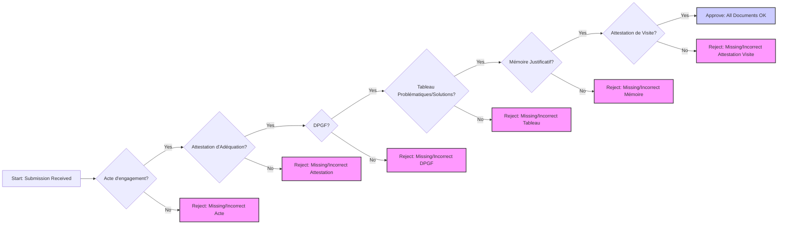

# Tender Analysis Report

## Executive Summary
## Executive Summary: Tender Analysis - Support et maintenance informatique des sites de la ville de Magnanville (Ref: 202510)

This executive summary provides an overview of the tender opportunity for IT support and maintenance services for the various sites of the Mairie de Magnanville (Ref: 202510). A comprehensive review of the tender documentation is necessary to determine if this opportunity aligns with our strategic objectives and resource capabilities.

**1. Project Scope and Objectives:**

The primary objective of this tender is to secure a reliable and efficient provider for ongoing IT support and maintenance services across the Mairie de Magnanville's various sites. The scope likely encompasses a range of services including, but not limited to, hardware maintenance, software support, network administration, cybersecurity measures, and potentially user training. Understanding the specific IT infrastructure and user base is crucial for a competitive and accurate proposal.

**2. Key Dates and Deadlines:**

[**Note:** *The actual deadlines need to be inserted here once obtained from the tender documents.  Examples are provided below, replace with actual dates.*]

*   **Submission Deadline:** [Insert Date]
*   **Contract Start Date (Estimated):** [Insert Date]
*   **Clarification Deadline:** [Insert Date]

Meeting these deadlines is paramount. A detailed timeline for proposal development and submission, including resource allocation, must be established immediately.

**3. Critical Requirements:**

The tender documentation will outline specific technical requirements, service level agreements (SLAs), and compliance standards. Critical requirements likely include:

*   **Response Times:** Defined SLAs for incident reporting and resolution.
*   **Security Protocols:** Adherence to specific cybersecurity standards and data protection regulations.
*   **Reporting and Documentation:** Comprehensive reporting on service performance and incident management.
*   **Local Presence:**  Proximity to Magnanville may be a significant advantage or even a mandatory requirement.

A thorough analysis of these requirements is essential to ensure our ability to meet or exceed expectations.

**4. Value Proposition:**

Our value proposition should emphasize our proven track record in providing comprehensive IT support and maintenance services to similar organizations. Key differentiators may include:

*   **Proactive Maintenance:**  Highlighting our commitment to preventative maintenance to minimize downtime.
*   **Scalability and Flexibility:**  Demonstrating our ability to adapt to the evolving needs of the Mairie de Magnanville.
*   **Cost-Effectiveness:**  Offering a competitive pricing structure that delivers exceptional value.
*   **Specialized Expertise:**  Showcasing our expertise in relevant technologies and industry best practices.

**5. Key Success Factors:**

Successful pursuit of this tender hinges on the following factors:

*   **Comprehensive Understanding:** A thorough understanding of the Mairie de Magnanville's IT environment and specific needs.
*   **Competitive Pricing:**  Developing a cost-effective solution that aligns with budgetary constraints.
*   **Strong Proposal:**  Creating a compelling and well-structured proposal that clearly articulates our value proposition.
*   **Resource Availability:**  Ensuring adequate resources are available to deliver the required services.

**Recommendation:**

A detailed review of the complete tender documentation is recommended to assess the feasibility and profitability of pursuing this opportunity. Following this review, a go/no-go decision should be made based on our ability to meet the critical requirements and provide a compelling value proposition.

## Tender Overview
- **Title:** Support et maintenance informatique des sites de la ville de Magnanville
- **Reference:** 202510
- **Entity:** Mairie de Magnanville
- **Sector:** Techniques de l'information et de la communication
- **Type:** Marché public de services
- **Location:** Magnanville, Rue de la Ferme, 78200 MAGNANVILLE
- **Estimated Value:** None

## Key Dates
- **Submission Deadline:** 2025-04-24 16:00:00+00:00
- **Start Date:** 2025-07-07 00:00:00+00:00
- **Clarification Deadline:** 2025-04-19 00:00:00+00:00
- **Evaluation Period:** None

## Technical Analysis
## Detailed Technical Analysis of the Tender Requirements for Magnanville City IT Support and Maintenance

This document provides a detailed technical analysis of the provided tender requirements for IT support and maintenance services for the city of Magnanville.  It breaks down the requirements, identifies potential challenges, suggests critical success factors, outlines necessary expertise, and assesses potential risks.

**I. Technical Requirements Analysis**

The tender specifies one core technical requirement, encompassing IT support and maintenance for the city's sites:

*   **TechnicalRequirement(category='Objet', description='Support et maintenance informatique des sites de la ville de Magnanville', mandatory=True, specifications=["Assurer le support par infogérance ou sur site de la maintenance et l'exploitation informatique des sites de la ville de Magnanville", "Prendre en charge l'administration et l'évolution du S.I. dans sa globalité"]**

**Breakdown of Specifications:**

*   **"Assurer le support par infogérance ou sur site de la maintenance et l'exploitation informatique des sites de la ville de Magnanville"**: This is the core requirement. It necessitates the provision of ongoing IT support, maintenance, and operational services for the city's IT infrastructure across all its sites.  This could encompass a wide range of services, depending on the city's current setup. The phrase "infogérance ou sur site" indicates the city is open to both remote management (managed services/outsourcing) and on-site personnel.

    *   **Support:**  This implies a helpdesk function, troubleshooting, and resolution of IT issues reported by city employees.  Response times and service level agreements (SLAs) are likely critical.
    *   **Maintenance:**  This covers proactive and reactive maintenance of hardware, software, and network infrastructure.  It includes patching, updates, hardware repairs, and preventative measures to ensure system stability and security.
    *   **Exploitation Informatique:** This focuses on the day-to-day operation of the IT systems. This includes monitoring system performance, managing backups, ensuring security protocols are followed, and maintaining system documentation.
    *   **"Sites de la ville de Magnanville":**  The bidder needs to understand the scope of "sites." This requires clarification on the number of locations, their geographic distribution, the types of IT infrastructure present at each site (e.g., offices, libraries, schools, public spaces with Wi-Fi), and the number of users.

*   **"Prendre en charge l'administration et l'évolution du S.I. dans sa globalité"**: This expands the scope beyond basic support and maintenance to include the administration and planned evolution of the city's entire information system (S.I.).

    *   **Administration:**  This involves managing user accounts, security policies, network configurations, server infrastructure, and other administrative tasks.  It requires a deep understanding of the city's IT architecture and operational procedures.
    *   **Évolution du S.I.:**  This implies a proactive role in planning and implementing upgrades, new technologies, and improvements to the IT infrastructure.  This could involve assessing the city's current IT needs, recommending solutions, and managing the implementation of new systems and applications.  This likely involves project management capabilities.  This also implies an understanding of the city's strategic goals and how IT can support them.

**II. Potential Challenges and Considerations**

*   **Understanding the Existing IT Infrastructure:**  Without a detailed understanding of the current IT environment (hardware, software, network, security protocols, documentation), it's impossible to accurately estimate the effort and resources required.  *The required "Attestation de visite" is likely crucial here.*
*   **Service Level Agreements (SLAs):** The tender doesn't explicitly mention SLAs, but they are implicitly required.  Defining clear and achievable SLAs for response times, resolution times, and system uptime is critical.
*   **Security:**  Ensuring the security of the city's IT infrastructure is paramount.  The bidder must demonstrate expertise in cybersecurity best practices, including vulnerability management, intrusion detection, and data protection.
*   **Scalability:**  The solution must be scalable to accommodate future growth and changes in the city's IT needs.
*   **Integration:**  The proposed solution must integrate seamlessly with existing IT systems and applications.
*   **Communication:**  Effective communication with city employees and stakeholders is essential.  This includes clear and timely updates on IT issues, projects, and changes.
*   **Language Barrier:** Documents must be in French or with certified translation. This implies the need for French-speaking personnel or translation services.

**III. Critical Success Factors**

*   **Thorough Assessment of the Existing IT Environment:**  A detailed assessment during the site visit is crucial for understanding the scope of the project and identifying potential challenges.
*   **Clear and Concise Proposal:**  The proposal must clearly articulate the bidder's understanding of the requirements, their proposed solution, and their ability to deliver the services.
*   **Strong Technical Expertise:**  The bidder must possess the necessary technical expertise in all relevant areas, including networking, server administration, security, and application support.
*   **Proactive Approach:**  A proactive approach to maintenance and problem-solving is essential for preventing issues and ensuring system stability.
*   **Effective Communication and Collaboration:**  Open communication and collaboration with city employees and stakeholders are critical for building trust and ensuring customer satisfaction.
*   **Well-Defined SLAs:**  Clear and achievable SLAs are essential for managing expectations and measuring performance.
*   **Competitive Pricing:**  The pricing must be competitive while still allowing for a sustainable and profitable business model.

**IV. Required Expertise and Resources**

*   **Helpdesk Support Staff:**  Trained IT support technicians to handle incoming requests and resolve common issues.
*   **System Administrators:**  Experienced system administrators to manage servers, networks, and security infrastructure.
*   **Network Engineers:**  Network engineers to design, implement, and maintain the city's network infrastructure.
*   **Security Specialists:**  Cybersecurity experts to protect the city's IT systems from threats.
*   **Project Managers:**  Experienced project managers to oversee IT projects and ensure they are delivered on time and within budget.
*   **French-Speaking Staff:**  Personnel proficient in French, both written and spoken, is essential for communication and documentation.
*   **Helpdesk Ticketing System:**  A robust ticketing system to track and manage support requests.
*   **Remote Monitoring and Management (RMM) Tools:**  RMM tools to proactively monitor system performance and identify potential issues.
*   **Backup and Disaster Recovery Solutions:**  Reliable backup and disaster recovery solutions to protect the city's data.
*   **Security Tools:**  Firewalls, intrusion detection systems, and other security tools to protect the city's IT systems.
*   **Transportation:** Resources for on-site visits, including reliable transportation.

**V. Risk Assessment**

*   **Inaccurate Assessment of IT Infrastructure:**  Underestimating the complexity or scope of the IT infrastructure could lead to cost overruns and service delivery issues.
*   **Security Breaches:**  A security breach could compromise sensitive data and damage the city's reputation.
*   **System Downtime:**  Prolonged system downtime could disrupt city services and impact citizen satisfaction.
*   **Lack of Communication:**  Poor communication could lead to misunderstandings and dissatisfaction among city employees.
*   **Inability to Meet SLAs:**  Failure to meet SLAs could result in penalties and damage the bidder's reputation.
*   **Staffing Issues:**  Difficulty finding and retaining qualified IT professionals could impact service delivery.
*   **Unexpected Costs:**  Unforeseen expenses, such as hardware failures or software licensing fees, could impact profitability.
*   **Changes in Technology:**  Rapid changes in technology could require ongoing investment in training and equipment.

**VI. Compliance Requirements Analysis**

The compliance requirements are separated into Candidature and Offre aspects.

* **Candidature**: These requirements focus on the bidder's qualifications and ability to perform the work.
    * **Capacité économique et financière**:  Demonstrate financial stability. The required documentation includes revenue figures for the past three years, showing the company's overall financial health and specific revenue related to similar IT services.  This ensures the bidder can sustain the operation financially.
    * **Capacité technique et professionnelle**: Demonstrate technical competence and experience.  This is supported by:
        *   Average annual workforce size and the number of management personnel for the last three years. This indicates the bidder's capacity to deploy sufficient resources.
        *   A list of major deliveries or services provided in the last three years, including amounts, dates, and recipients.  This provides evidence of relevant experience and successful project delivery.
        *   *Attestation de visite signée*: This is crucial. It proves the bidder physically inspected the sites and has a realistic understanding of the environment.

* **Offre**: These requirements focus on the content and format of the bid itself.
    * **Documents remis en français, ou avec traduction certifiée**: all documents must be in French, or accompanied by a certified translation.
    * **Acte d'engagement dûment rempli**: A filled out and signed commitment document.
    * **DPGF**: A detailed breakdown of the overall price, filled out in Excel and provided in both Excel and PDF formats. This allows the city to understand the cost

## Compliance Requirements
# Tender Compliance Checklist

## Tender Information
- Title: Support et maintenance informatique des sites de la ville de Magnanville
- Reference: 202510
- Entity: Mairie de Magnanville

## Key Dates
- Submission Deadline: 2025-04-24 16:00:00+00:00
- Start Date: 2025-07-07 00:00:00+00:00
- Clarification Deadline: 2025-04-19 00:00:00+00:00

## Compliance Requirements

### Candidature
- [ ] Capacité économique et financière
- [ ] Capacité technique et professionnelle

Required Documentation:
- [ ] Déclaration concemant le chiffre d'affaires global du candidat et, le cas échéant, le chiffre d'affaires du domaine d'activité faisant l'objet du marché public, portant au maximum sur les trois derniers exercices disponibles en fonction de la date de création de l'entreprise ou du début d'activité de l'opérateur économique, dans la mesure où les informations sur ces chiffres d'affaires sont disponibles.
- [ ] Une déclaration indiquant les effectifs moyens annuels du candidatet l'importance du personnel d'encadrement pour chacune des trois dernières années.
- [ ] Une liste des principales livraisons effectuées ou des principaux services fournis au cours des trois dernières années, indiquant le montant, la date et le destinataire public ou privé. Les livraisons et les prestations de services sont prouvées par des attestations du destinataire ou, à défaut, par une déclaration de l'opérateur économique.
- [ ] Attestation de visite signée

### Offre
- [ ] Documents remis en français, ou avec traduction certifiée

Required Documentation:
- [ ] Acte d'engagement dûment rempli, daté par la personne habilitée à engager la société
- [ ] Décomposition du prix global et forfaitaire (DPGF) dûment remplie, tamponnée et signée en format excel et PDF
- [ ] Attestation d'Adéquation des compétences avec le périmètre d'intervention dûment remplie, datée et signée en format excel et PDF
- [ ] Tableau des problématiques rencontrées et des résolutions proposées par le candidat dûment renseigné, daté et signé sous format excel et PDF
- [ ] Mémoire (maxi 20 pages + annexes éventuelles) justificatif comprenant : - Méthodologie de la mise en place pour l'exécution des prestations (hotline, réunion...), - Les moyens humains dédiés pour la bonne exécution des prestations, - Les matériels spécifiques pour l'exécution des prestations.
- [ ] Attestation de visite en annexe correctement complétée


## Strategic Analysis
## Executive Briefing: Magnanville IT Support & Maintenance Contract

**Subject:** Assessment of opportunity to bid on the Magnanville IT support and maintenance contract.

**Date:** October 26, 2023

**1. Key Strategic Considerations:**

*   **Unknown Budget:** The absence of a defined budget range poses a significant challenge. Winning the bid requires a deep understanding of actual costs and the development of a highly competitive and adaptable pricing strategy.
*   **Compliance Requirements:** Strict adherence to French language requirements and precise document submission protocols is crucial. Failure to comply will result in disqualification.
*   **Renewal Clause:** The potential for a 3-year renewal offers long-term revenue potential, making a competitive initial bid strategically important.
*   **Negotiation Risk:** The buyer's right to negotiate introduces uncertainty. Our bidding strategy must allow for flexibility.

**2. Critical Success Factors:**

*   **Financial Viability:** Determine the actual budget range through due diligence and develop a pricing model that ensures profitability while remaining competitive.
*   **Compliance Mastery:** Guarantee strict adherence to all language, formatting, and submission requirements.
*   **Effective Risk Mitigation:** Implement robust strategies to address technical, financial, operational, compliance, market, and resource-related risks.
*   **Resource Securing:** Secure qualified personnel with necessary IT infrastructure and system administration skills.
*   **Infrastructure Compatibility:** Demonstrate a clear understanding of the existing IT infrastructure and propose solutions that integrate seamlessly.

**3. Major Risks and Opportunities:**

*   **Risks:**
    *   **Financial Risks (Medium Probability, Medium Impact):** Inaccurate cost analysis, budget overruns, and subcontractor instability.
    *   **Operational Risks (Medium Probability, High Impact):** Failure to meet service level agreements (SLAs), communication breakdowns, and inadequate incident management.
    *   **Compliance Risks (Medium Probability, Medium Impact):** Non-compliance with French regulations and document submission errors.
    *   **Resource Risks (Medium Probability, Medium Impact):** Lack of skilled personnel and inadequate resource allocation.
*   **Opportunities:**
    *   **Renewal Clause:** The potential for a 3-year renewal provides a significant long-term revenue opportunity.
    *   **No Mandatory Services:** The absence of mandatory optional services simplifies the scope and potentially reduces bidding complexity.
    *   **No Variants Required:** Focusing on a single solution streamlines the bidding process.

**4. Resource Implications:**

*   **HR:** Dedicated IT support and maintenance personnel with expertise in infogérance, maintenance informatique, and system administration are required, starting July 7, 2025.
*   **Financial:** Requires a realistic budget encompassing all potential costs, from initial bid preparation to ongoing service delivery.
*   **Legal:** Potential need for legal advice to ensure compliance with French regulations.
*   **Translation:** Costs associated with certified translations of all required documents.

**5. Strategic Recommendations:**

*   **Immediate Action:** Conduct thorough due diligence to uncover the actual budget range.
*   **Pricing Strategy:** Develop a detailed and competitive pricing strategy that accounts for all potential risks and costs.
*   **Compliance Focus:** Prioritize compliance by engaging native French speakers and legal counsel to ensure document accuracy and adherence to regulations.
*   **Risk Mitigation Plan:** Develop a comprehensive risk mitigation plan addressing technical, financial, operational, and compliance risks.
*   **Resource Allocation:** Secure necessary resources, including qualified personnel, and develop a resource management plan.
*   **Ongoing Performance Monitoring:** Establish clear communication channels, reporting systems, and regular performance reviews to ensure adherence to SLAs and contract terms.
*   **Go/No-Go Decision:** Re-evaluate the opportunity after obtaining clarity on the budget. If the budget is insufficient to deliver high-quality service profitably, a "no-go" decision should be considered.

**Overall Assessment:** The success probability of this bid is currently assessed as **Low** due to the unknown budget and stringent compliance requirements. Aggressive due diligence and a meticulously planned strategy are essential to improve the chances of success.

## Detailed Analysis

### Financial Requirements
- **Budget Range:** Unknown
- **Currency:** Unknown

#### Payment Terms
- Unknown

#### Financial Criteria
- Chiffre d'affaires global du candidat
- Chiffre d'affaires du domaine d'activité faisant l'objet du marché public

### Risk Assessment

#### Technical risks
- **Probability:** Medium
- **Impact:** Medium
- **Mitigation Strategies:**
  - Ensure clear documentation of existing IT infrastructure.
  - Conduct thorough testing of proposed solutions.
  - Establish a well-defined change management process.
  - Implement robust security measures and monitoring systems.
  - Develop a detailed disaster recovery plan.
  - Ensure proper data recovery and backup procedures are in place

#### Financial risks
- **Probability:** Medium
- **Impact:** Medium
- **Mitigation Strategies:**
  - Conduct a detailed cost analysis.
  - Develop a realistic budget.
  - Establish clear payment terms.
  - Implement cost control measures.
  - Ensure financial stability of subcontractors.
  - Negotiate favorable contract terms

#### Operational risks
- **Probability:** Medium
- **Impact:** High
- **Mitigation Strategies:**
  - Develop clear service level agreements (SLAs).
  - Establish efficient communication channels.
  - Implement robust monitoring and reporting systems.
  - Ensure adequate staffing and training.
  - Develop a detailed incident management process.
  - Conduct regular performance reviews.
  - Ensure compliance with data protection regulations

#### Compliance risks
- **Probability:** Medium
- **Impact:** Medium
- **Mitigation Strategies:**
  - Ensure compliance with all relevant laws and regulations.
  - Maintain accurate records.
  - Implement a robust audit trail.
  - Seek legal advice when necessary.
  - Ensure all documents are submitted in the required format and language.
  - Adhere to the specified deadlines for submission of documents

#### Market risks
- **Probability:** Low
- **Impact:** Medium
- **Mitigation Strategies:**
  - Conduct market research to understand competitive landscape.
  - Develop a competitive pricing strategy.
  - Differentiate service offerings.
  - Monitor competitor activities.
  - Identify potential partners or subcontractors.
  - Adapt to changing market conditions

#### Resource risks
- **Probability:** Medium
- **Impact:** Medium
- **Mitigation Strategies:**
  - Develop a resource management plan.
  - Ensure availability of skilled personnel.
  - Provide adequate training and development.
  - Implement a backup plan for critical resources.
  - Manage resource allocation effectively.
  - Ensure subcontractors have adequate resources

### Competitive Analysis

#### Market Position
Unknown

#### SWOT Analysis
- **Strengths:**
  - NA

- **Weaknesses:**
  - NA

- **Opportunities:**
  - Renewal Clause
  - The consultation does not include any additional optional or mandatory services.
  - No variants required

- **Threats:**
  - The buyer reserves the right to negotiate
  - Mandatory site visit
  - The documents must be remitted in French, or with a certified translation
  - The composition of the grouping cannot be modified between the date of submission of applications and the date of signature of the contract

## Budget Analysis

- **Total Estimated Cost:** Unknown
- **Contingency Percentage:** 0.05%

### Budget Breakdown

#### Personnel Costs
- **Estimated Cost:** Unknown
- **Cost Type:** Variable
- **Notes:**
  - Technicians for on-site support
  - Help desk personnel
  - System administrators

#### Software Licenses
- **Estimated Cost:** Unknown
- **Cost Type:** Recurring
- **Notes:**
  - Operating system licenses
  - Antivirus software
  - Management and monitoring tools

#### Hardware Maintenance
- **Estimated Cost:** Unknown
- **Cost Type:** Recurring
- **Notes:**
  - Maintenance of existing hardware
  - Potential hardware upgrades

#### Travel Costs
- **Estimated Cost:** Unknown
- **Cost Type:** Variable
- **Notes:**
  - Travel to Magnanville sites for on-site support

#### Training
- **Estimated Cost:** Unknown
- **Cost Type:** One-time
- **Notes:**
  - Training for personnel on the existing systems

#### Visit Costs
- **Estimated Cost:** Unknown
- **Cost Type:** One-time
- **Notes:**
  - Costs associated with the mandatory site visit

#### Administration Costs
- **Estimated Cost:** Unknown
- **Cost Type:** Fixed
- **Notes:**
  - General overhead and administrative costs

#### Software Tools
- **Estimated Cost:** Unknown
- **Cost Type:** One-time
- **Notes:**
  - Specific software for SI administration

#### Contingency
- **Estimated Cost:** Unknown
- **Cost Type:** Fixed
- **Notes:**
  - Unforeseen issues

## Project Timeline

- **Total Duration:** 12 months
- **Critical Path Duration:** 3 months

### Project Phases

#### System Setup
- **Duration:** 2 weeks
- **Start Offset:** 0 weeks
- **Critical Path:** Yes
- **Key Deliverables:**
  - Initial setup of IT support system

#### Ongoing Support
- **Duration:** 1 month
- **Start Offset:** 2 weeks
- **Critical Path:** Yes
- **Key Deliverables:**
  - Ongoing IT support and maintenance

#### Documentation
- **Duration:** 2 weeks
- **Start Offset:** 2 weeks
- **Critical Path:** No
- **Key Deliverables:**
  - Documentation of IT systems

## Stakeholder Analysis

### Procuring Entity
- **Influence Level:** High
- **Interests:**
  - Ensuring reliable IT support and maintenance
  - Securing value for money
  - Compliance with regulations

**Engagement Strategy:**
  - Information sharing
  - Consultation

### Potential Bidders
- **Influence Level:** Medium
- **Interests:**
  - Winning the tender
  - Profitability
  - Building a relationship with the Mairie de Magnanville

**Engagement Strategy:**
  - Information seeking
  - Competitive bidding

### Service Technique (Mairie de Magnanville)
- **Influence Level:** High
- **Interests:**
  - Seamless IT operations
  - Effective problem resolution
  - User satisfaction

**Engagement Strategy:**
  - Consultation
  - Collaboration

### IT Users (Mairie de Magnanville)
- **Influence Level:** Medium
- **Interests:**
  - Reliable IT services
  - Minimal downtime
  - Easy access to support

**Engagement Strategy:**
  - Information sharing
  - Feedback

### Prestataire Sortant
- **Influence Level:** Low
- **Interests:**
  - Smooth handover
  - Protecting their reputation

**Engagement Strategy:**
  - Information transfer

## Visualizations

### Project Timeline
```mermaid
```mermaid
%% Gantt Chart for Project Timeline
gantt
    dateFormat  YYYY-MM-DD
    title Tender Analysis Timeline - IT Support System

    section Project
    Submission Deadline           :crit, 2024-01-01, 0d
    Project Start Date            :crit, 2024-01-15, 0d
    Total Duration                :2024-01-01, 12mo

    section Timeline Phases
    System Setup                  :crit, 2024-01-15, 2wk
    Ongoing Support               :crit, after System Setup, 1mo
    Documentation                 :after System Setup, 2wk

    section Buffer Periods
    Clarification Buffer          : 2023-12-25, 1wk
    Pre-Submission Buffer         : before Submission Deadline, 1wk

    section Key Deliverables
    Initial Setup of IT support system   : System Setup, 0d
    Ongoing IT support and maintenance : Ongoing Support, 0d
    Documentation of IT systems        : Documentation, 0d

```

```mermaid
%% Mindmap for Stakeholder Relationships
mindmap
  root((Tender: IT Support - Mairie de Magnanville))
    Procuring Entity
      [[Ensuring reliable IT support]]
      [[Securing value for money]]
      [[Compliance with regulations]]
      Information Sharing
      Consultation

    Potential Bidders
      [[Winning the tender]]
      [[Profitability]]
      [[Building a relationship]]
      Information Seeking
      Competitive Bidding

    Service Technique (Mairie)
      [[Seamless IT operations]]
      [[Effective problem resolution]]
      [[User satisfaction]]
      Consultation
      Collaboration

    IT Users (Mairie)
      [[Reliable IT services]]
      [[Minimal downtime]]
      [[Easy access to support]]
      Information Sharing
      Feedback

    Prestataire Sortant
      [[Smooth Handover]]
      [[Protecting Reputation]]
      Information Transfer

    Key Relationships
      Service Technique <--> Prestataire Sortant

    Communication Strategy
      [[e.marchespublics.com]]
      [[Clarification Responses]]
```


```

## Evaluation Criteria
- Valeur technique au vu du mémoire technique (60 points)
- Valeur financière au vu du prix indiqué dans la DPGF en format excel et PDF (40 points)
